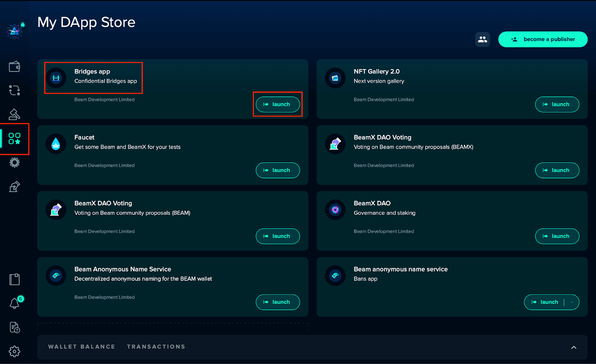

# Creating Cross-chain transactions

The article below will cover how to utilize Bridges to create cross-chain transactions from [**Ethereum to Beam**](creating-cross-chain-transactions.md#send-usdeth-from-ethereum-to-beam) and [**Beam to Ethereum**](creating-cross-chain-transactions.md#send-usdbeth-from-beam-to-ethereum). The steps below provide a foundation for completing cross-chain transactions with all supported tokens, which include:

* $ETH
* $USDT
* $DAI
* $WBTC, $bETH on Ethereum.&#x20;
* $bUSDT, $bDAI, $bWTC on Beam.&#x20;

## **Send $ETH from Ethereum to Beam**

Now that your MetaMask wallet configuration is complete, it is time to create a transaction and test the Ethereum to Beam bridge!

1. Launch the Bridge app from the DApp store in Beam Wallet ** **>>> "DApp store"** **>>> "Bridges app"**.
2. Select **"Ethereum to Beam"**.
3. Click **“Ethereum” from the drop-down currency list and select “AUTOMATIC WAY”** prompting a browser pop-up.
4. In the browser, connect **MetaMask wallet**. Select **"Ethereum to Beam"** .
5. Enter the transfer amount. **Click "transfer".**&#x20;
6. **Confirm the transaction** in a MetaMask pop-up. A transaction notification will appear in the browser.
7. When the transaction is complete**, the bETH can now withdraw to your Beam Wallet**.
8. Your new balance will be reflected in your Beam wallet!

## How it looks in your Beam Wallet

### The Bridge app is located in the Beam Wallet DApp store

Launch the DApp Store in Beam Wallet and select the "Bridges app".&#x20;

<figure><figcaption></figcaption></figure>

### **"Ethereum to Beam"**

<figure><figcaption></figcaption></figure>

### **"Ethereum" and the "AUTOMATIC WAY"**

Select Ethereum from the list of currencies in the dropdown menu.

<figure><figcaption></figcaption></figure>

### Connect MetaMask and establish Ethereum to Beam Bridge

A pop-up browser will appear, allowing users to connect their MetaMask wallets. Select "Etheerum to Beam Bridge".

<figure><figcaption></figcaption></figure>

#### Ethereum to Beam Bridge

<figure><figcaption></figcaption></figure>

### Create a transfer

Enter the amount of Ethereum you wish to transfer and then select "transfer".

<figure><figcaption></figcaption></figure>

### **Confirm transaction**

Confirm the transaction details that appear in the MetaMask pop-up.&#x20;

#### Transaction notification

After the transaction is confirmed, a transaction notification will appear in the browser window.

<figure><figcaption></figcaption></figure>

### Withdraw bETH to Beam wallet

Once the transfer is complete, the bETH will be available to withdraw to your Beam wallet.

<figure><figcaption></figcaption></figure>

#### Confirm withdraw

<figure><figcaption></figcaption></figure>

### Transaction complete

After the transaction is complete, the new balance will be reflected directly in your Beam wallet.&#x20;

<figure><figcaption></figcaption></figure>

#### Transaction details

<figure><figcaption></figcaption></figure>

## **Send $bETH from Beam to Ethereum**

Create a transaction and test the Beam to Ethereum bridge!

1. Launch the **DAppnet** **>>> "DApp store"** **>>> "Bridges app"**.
2. Select **"Beam to Ethereum" >>>** click **"Ethereum side of the bridge”** prompting a browser pop-up.
3. In the browser, connect MetaMask wallet. **Copy** **Ethereum bridge address**.
4. Return to Beam Wallet, **paste your Ethereum Bridge address** and enter the currency amount, transfer amount, and verify gas fees. **Select “transfer”.**
5. Verify the transaction details. **"Confirm transfer"**. If no human or technical error occurred, the transaction will appear in both Beam and MetaMask wallets!

## How it looks in your Beam Wallet

### DApp Store

Launch the DAPP in Beam Wallet and select the "Bridges app".&#x20;

<figure><figcaption></figcaption></figure>

### "Beam to Ethereum"

Click on "Beam to Ethereum" and in the next window. Click "ethereum side of the bride", prompting a browser pop-up to appear in chrome.

<figure><figcaption></figcaption></figure>

#### "Ethereum side of the bridge"

<figure><figcaption></figcaption></figure>

### Ethereum to Beam Bridge

In the browser, connect MetaMask wallet and copy the Ethereum Bridge address.

<figure><figcaption></figcaption></figure>

### Enter currency and transfer amount

Enter the amount of Beam you wish to send. Verify all transaction details before completing the transfer.

<figure><figcaption></figcaption></figure>

### Confirm transaction details

Verify all the details of the before completing the transaction.

&#x20;

<figure><figcaption></figcaption></figure>

### Transaction complete

Successful Beam to Ethereum transactions will appear under "Bridges App Transactions".

<figure><figcaption></figcaption></figure>

#### Transaction info

<figure><figcaption></figcaption></figure>

##
