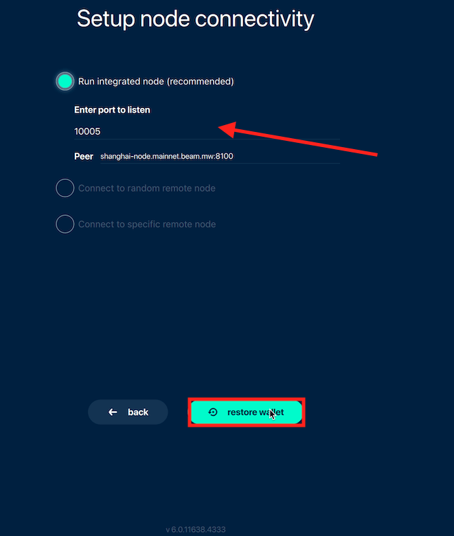

# Restore Wallet

Life is complicated: hard drives crash, devices get stolen, but if you have taken the proper steps of securing your seed phrase when first creating your Beam wallet, then you can breathe a little easier knowing your funds are safe and secure.


For the restoration process, you must connect to the network via the integrated node. Wallet restoration does not work with random remote node or specific remote node.


## Restoring your wallet

1. **Launch** Beam desktop wallet .
2. **Click "restore wallet or create a new one" > "Proceed"** to restore your wallet.
3. **Click "Restore wallet" > "I agree"** to proceed.
4. **Enter your seed phrase** > **Click "I understand"** to restore your wallet.
5. Create a wallet password.
6. **Select node connectivity mode > Click "Restore wallet"** to complete the wallet restoration process.

Once you have completed the steps to restore your wallet, your wallet will refresh and automatically re-synch with the blockchain (please be patient as the process can be lengthy).


Your transaction history and addresses will not appear in your new wallet without also migrating your `wallet.db` file.


## How it looks in your wallet

### Beam wallet login page

### 'Restore wallet...' dialogue box

A dialogue will appear, notifying you that your wallet transaction history and saved addresses will be lost if you proceed.&#x20;

### Restore wallet screen

Click **restore wallet.**

### 'Restore wallet...' dialogue box

A dialogue box will notify you that your wallet transaction history and saved addresses will be lost if you proceed.&#x20;

### Enter seed phrase

Enter your seed phrase (double-check your spelling).

### Confirmation screen

A dialogue box will alert you to the dangers of running two wallets from one seed phrase simultaneously. Your transaction histories may not synch up.&#x20;

### Create a wallet password

Create a password (ten characters minimum, at least one letter, number, or special symbol) that will give you access to your Beam wallet. Your wallet password is an extra lock for your device, while your seed phrase is a private key that identifies your wallet and can access your funds.

Choose a strong password.

.png>)

### Setup node connectivity

We strongly recommend you chose to run the integrated node. You can connect to a specific random node or a remote node.

### Restoring process

Please be patient: restoring funds is a lengthy, and thorough process.

