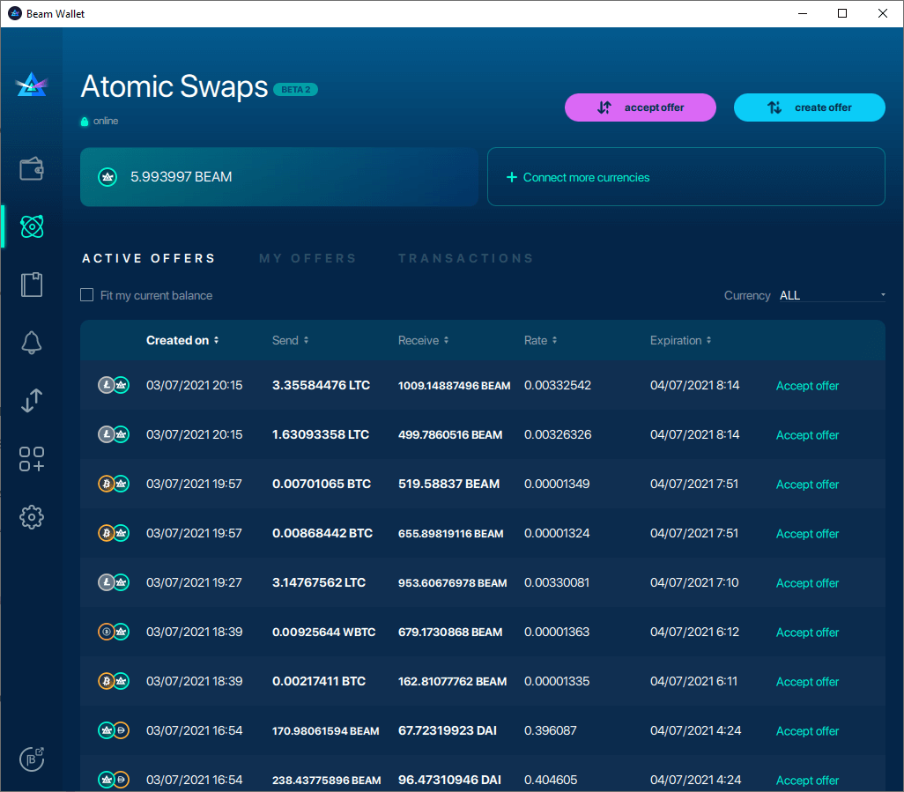

# Atomic Swaps

Beam offers Atomic Swap functionality, enabling peer-to-peer trading of Beam for Bitcoin, Ethereum, Litecoin, DOGE (and more) in a completely decentralized way without an exchange or third-party intermediary. Atomic Swaps are the pinnacle of decentralization, censorship resistance, and core values of cryptocurrencies.

Atomic Swaps are supported only on Beam Desktop Wallets, including the Atomic Swap Marketplace for publishing and accepting swap offers.

See [Atomic Swaps design](https://github.com/BeamMW/beam/wiki/Atomic-swap) or [Atomic Swap token format](https://github.com/BeamMW/beam/wiki/Atomic-swap-token) for more detailed information regarding Atomic Swaps.

