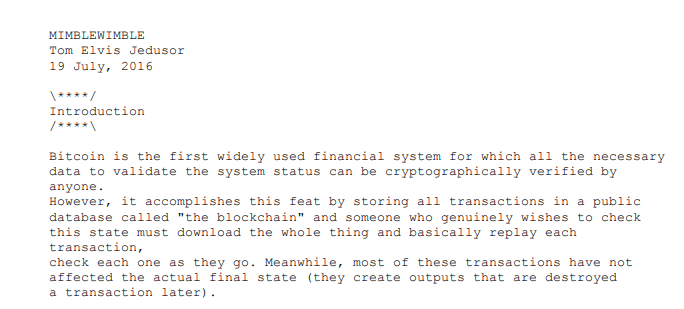
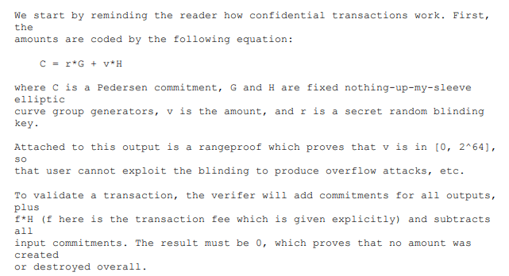

# Mimblewimble

Mimblewimble is an innovative confidential cryptocurrency protocol described initially in a whitepaper published in October 2016 by an anonymous author under the pseudonym of Tom Elvis Jedusor.&#x20;

In this relatively short whitepaper (only six pages), the author has presented a fantastic idea: building a confidential value exchange protocol that does not bloat the blockchain size but instead compressing the blockchain by removing the intermediate transactions while validating the entire blockchain.

To achieve this, replacing the UTXO with Pedersen Commitments and then validating block validity by summing up all inputs and outputs and ensuring that the resulting sum is zero (or more precisely equal to coinbase transaction). Since the same approach can extend to all blocks, the resulting blockchain size growth is a function of UTXOs rather than transactions (which, in average cases, produces an order of magnitude smaller blockchain). Each UTXO also contains a zero-knowledge range proof that ensures the UTXO value is positive..

To balance the difference in blinding factors, each transaction also contains the "kernel," which includes the signed difference in its simplest form.&#x20;

Mathematician [Andrew Poelstra](https://www.linkedin.com/in/andrew-poelstra-958a75106/) first reviewed the protocol and published a paper validating the approach.



Beam started by implementing the whitepaper verbatim and later expanded it by first adding relative kernels and later Lelantus shielded pool and eventually the Beam Virtual Machine that allows to run smart contracts thus transforming Beam into a fully functional Confidential DeFi Platform.

The Beam development team's initial approach was to implement the whitepaper verbatim. They later tweaked the protocol by adding relative kernels before implementing a Lelantus shielded pool. Finally, the Beam Virtual Machine ran smart contracts, thus transforming Beam into a fully functional Confidential DeFi Platform.

See [Beam technical specifications](https://github.com/BeamMW/beam/wiki/Beam-Technical-Specifications) and [Transaction Creation Protocol](https://github.com/BeamMW/beam/wiki/Transaction-creation-protocol) for additional information detailing the math and design decisions behind Beam Mimblewimble implementation.

####

####
