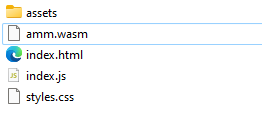
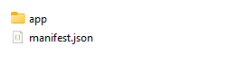

# Create dapp for Beam!

1. You must create manifest.json:

> {
> 
> "name":  "",   //required
> 
> "description":  "", //required
> 
> "url":  "localapp/app/index.html", //required
> 
> "version":  "1.1.17", //required
> 
> "api_version":  "7.0", //required
> 
> "min_api_version":  "7.0", //required
> 
> "icon":  "localapp/app/logo.svg", //required
> 
> "guid":  "d353352eb6a94618ac0a8ec7b29ca7bb" //required
> 
> }

>Dapps limits:
> 
>name - 30 length
>
>description 1024 length
>
>api_version - 10 length
>
>min_api_version - 10 length
>
>icon - 10240 kbit

2. Create app folder and put in build your application.

   
3. You must get app folder and manifest.json and  need put this in .zip

4. Then you change .zip to .dapp.

 to 

5. Then you will load your dapp in dappstore.
