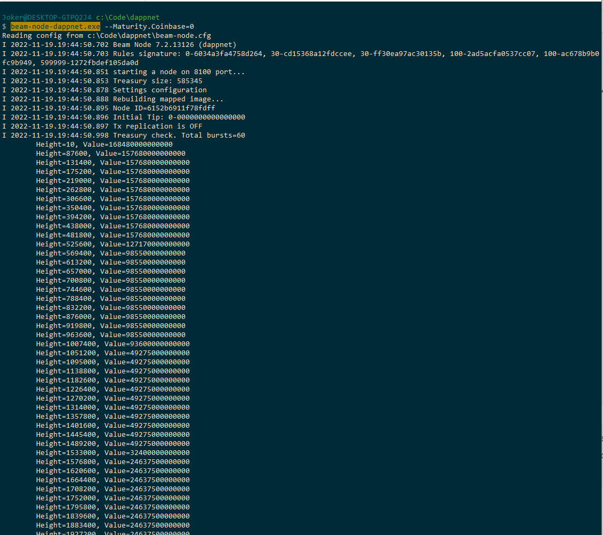

# Running local blockchain

In this tutorial we will explain how to run local blockchain. It will be extremely useful for testing your dapps locally, before deplying them to public networks


### Download node and wallet&#x20;

Create an empty folder (called dappnet in our examples) and download the binaries for the node and CLI wallet from [beam website](https://beam.mw/downloads/dappnet)

### Initialize wallet&#x20;

First, let's change the wallet configuration file to make everything easy and seamless when we run it later. Edit the beam-wallet.cfg file and set the following flags:

```

# General options:
################################################################################

# log level [info|debug|verbose]
log_level=debug

# file log level [info|debug|verbose]
# file_log_level=debug

# old logs cleanup period (days)
# log_cleanup_days=5

################################################################################
# Wallet options:
################################################################################

# password for the wallet
pass=123

# phrase to generate secret key according to BIP-39.
# seed_phrase=

# address of node
node_addr=127.0.0.1:8100

# path to wallet file
wallet_path=wallet.db

Maturity.Coinbase=0

# command to execute [new_addr|send|receive|listen|init|info|export_miner_key|export_owner_key|generate_phrase]
# command=listen


```


Note the Maturity.Coinbase=0 flag. It means that you can spend coinbase rewards immediately (unlike the 60 block lockup in mainnet) It is useful for testing in a local environment, since you do not have to wait for your mined rewards to before available


Now let's move on to wallet initialization. Run

`beam-wallet-dappnet.exe init`  (or ./beam-wallet-dappnet on Mac)

Save the generated seed phase somewhere in a text file ( we might need it later)

Now print the owner key by running:

`beam-wallet-dappnet.exe export_owner_key`

And last generate the mining key by running

`beam-wallet-dappnet.exe export_miner_key --subkey=1`

Save both keys in the same file as the seed phrase


### Initializing the Node

Before we start configuring the node, download sample Beam treasury file [treasury.bin](https://github.com/BeamMW/beam/blob/master/treasury.bin), and copy it to the same folder as the `beam-node` binary.

Now, open beam-node.cfg file in a text editor and set the following flags:

```
################################################################################
# General options:
################################################################################

# port to start server on
port=8100

# log level [info|debug|verbose]
log_level=debug

# file log level [info|debug|verbose]
file_log_level=debug

# old logs cleanup period (days)
# log_cleanup_days=5

################################################################################
# Node options:
################################################################################

# node storage path
# storage=node.db

# nodes to connect to !!! MUST BE EMPTY !!!
# peer=

# port to start stratum server on
# stratum_port=0

# path to stratum server api keys file, and tls certificate and private key
# stratum_secrets_path=.

# Enforce re-synchronization (soft reset)
# resync=0

# Owner viewer key
owner_key=<your owner key>

# Standalone miner key
miner_key=<your miner key>

# password for keys
pass=123

# Fork1 height
# Fork1=

# Path to treasury for testing
treasury_path=treasury.bin

# Enables the node to produce blocks
mining_threads=1

Maturity.Coinbase=0


```


1. Make sure to set miner and owner keys to those generated by your wallet
2. Make sure peer list is empty (to avoid accidental connections to other nodes)
3. Check that mining\_threads flag is set to 1


We are now ready to run the node using the command:

`beam-node-dappnet.exe`

Sample output should look something like this

<figure><figcaption></figcaption></figure>

Wait for about 30 seconds to make sure new blocks are produced. A new block shoud appear every 15 seconds or so

<figure><figcaption></figcaption></figure>

Synchronizing the wallet

In another command line (or Terminal) window, run the CLI wallet with the following command:

`beam-wallet-dappnet.exe listen`

This will synchronize the wallet state with the blockchain. Your output should read something like:

<figure><figcaption></figcaption></figure>

Stop the wallet (by clicking Ctrl + C) and check your current balance by running:

`beam-wallet-dappnet.exe info`

You should see the mined BEAM coins in your wallet&#x20;

<figure><figcaption></figcaption></figure>

You now have a local network!


For a full reference on Beam CLI wallet see the [CLI Wallet Guide](https://beamx.gitbook.io/cli-guide/)

