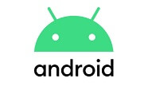

# Mobile Wallet User Guide

We aim to make accessing your Beam coins as convenient and straightforward as possible, which is why we introduced the Beam mobile app for iOS and Android. &#x20;

Users can now send, store or receive Beam and Confidential Assets (Tokens) across multiple wallets with the simplicity of mobile and all the advanced privacy settings of Beam desktop wallet.


**Note:** advanced features such as [Atomic Swaps](https://beamx.gitbook.io/atomic-swaps-desktop-guide/-Ma18rFhhJ0iJaAAv2-M/) and the [DAPP](https://beamx.gitbook.io/desktop-wallet-user-guide/-MazOCfj5sWCcgrEum9r/daap-store) are only available on the Beam desktop wallet.


## Downloading Beam mobile (Android)

Android users can download the APK file directly from our main [website](https://beam.mw/downloads/mainnet-mac) or download it from the [Google Play Store](https://play.google.com/store/apps/details?id=com.mw.beam.beamwallet.mainnet).

## Downloading Beam mobile (iOS)

iOS users can search for Beam mobile wallet on the App Store or click on the App Store logo on our [main website](https://beam.mw/downloads/mainnet-mac) to redirect to the download page on the [App Store](https://apps.apple.com/us/app/beam-privacy-wallet/id1459842353?ls=1).

