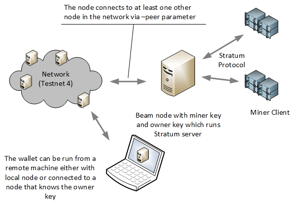

# Mining Mode

Beam Node supports External Miner via Stratum Server API for mining Beam: Beam Node provides built-in support for Stratum API integration with multiple external mining clients to a single node. Stratum clients can be run together with the internal Miner. For more detailed information, and how-to mine Beam, please see our [Beam Mining guide](https://beamx.gitbook.io/beam-mining/-MdvMMR0TdumadxyPDa1/).


**Obtain your Miner Keys!**

To ensure all the rewards you accrue mining Beam go directly to your wallet, you must obtain your secret **`miner_key`**. Your mining key is derived from your seed phrase. You can generate multiple mining keys for separate mining modes.

Conversely, to display your total mining rewards accrued to all the nodes on the Beam network, you must obtain an **owner\_key**. Owner keys only identify the cumulative mining rewards earned by a user, regardless of the node used.

For more information on retrieving or displaying mining and owner keys, please see our Beam Mining guide_._


## Mining Beam

Beam is a Mimblewimble implementation. We use classic Proof-of-Work (PoW) consensus.

Alike most cryptocurrencies, Beam relies on miners to add transactions to the blockchain. While all nodes in the Beam network confirm the validity of transactions, Beam counts on miners to take on the massive heavy lifting to guard the network.

We welcome everyone to join our mining community to support the network and earn Beam coins.

## Mining algorithm

To secure the network, Beam uses the uses a [modified version](https://docs.beam.mw/Beam\_Equihash.pdf) of the Equihash (150,5) proof-of-work mining algorithm. Miners and their mining rigs compete to produce a new block on the chain. The miner who completes the computation for each block earns a network standard block reward, including any transactions fees added to that block.

At Mainnet launch, the Equihash parameters were: n=150, k=5. In addition, we will introduce a slight change to the datapath to further reduce the chance of zero-day ASICs.

The minimal memory requirement for the GPU is 4 GB. The most up-to-date list of supported GPUs will be made [available](broken-reference).

## Block size and time

A Beam block will be generated approximately every minute and contain about 1000 transactions. Block size is roughly 1 MB.

## Mining difficulty

One can define 'difficulty' as the inverse probability of a random solution being the correct one. Mining difficulty measures how many attempts, on average, it is required to find the necessary proof-of-work solution to mine a block and receive the mining reward. Thus, a difficulty of 100 means that (on average) one in 100 tries should produce a valid block.

In Proof of Work blockchains, the difficulty is a dynamic parameter, periodically retargeted to reflect the fluctuations in all the miners' total computational power while accounting for changes in the mining competition and improvements in mining technology.

The goal of updating the difficulty is to keep the average block time at a certain value. In Beam, the target block time is 60 seconds, which underpins a constant currency issuance and the transaction settlement time of the network.

Here's an example: let's assume we have 100 miners in our network, each attempting a different solution, finding one roughly every minute. Now 100 more miners enter, the hash rate of the network doubles, the solution on average reduces by half (30 seconds). If 200 more join, the time halves into 15 seconds, and so on.

Beam nodes attempt to mitigate that by increasing the difficulting of the proof-of-work algorithm as more miners join, reducing the difficulty as the number of miners decreases.

In Beam, the difficulty reassess with every block: the algorithm looks at the average time and the average difficulty of the last 1440 blocks. If the time required to mine the previous 1440 blocks is higher or lower than 24 hours, the problem retargets accordingly.

The detailed algorithm is outlined below:

1. Review the last seven blocks, identifying the block with the median block time, this is the **`Window End block`**.
2. Review blocks from 127 to 120 before the current block (seven blocks total), identifying the block with the median block time out of those, this is the **`Window Start block`**.
3. Sum the difficulties of the blocks from `Window Start` to `Window End`; this is **`Delta Work`**.
4. Calculate the time difference between `Window Start` and `Window End` blocks; this is **`Delta Time`**.
5. Calculate the difficulty for next block as: `NewDifficulty` = (`Delta Work` / `Delta Time`) \* 60 seconds.
6. The `Delta Time` is bound by one and 4 hours; e.g., it is considered `Delta Time` if the difference is less than one hour. Same for differences more than 4 hours, preventing extreme changes in difficulty.

The above algorithm ensures that as the total solution power of the network fluctuates, the difficulty is gradually adjusted, ensuring the target block time.

## Treasury

For the first five years of Beam's emission schedule, block rewards will allocate to the Beam Treasury (along with miners) for every block mined.

‌During year one, the Treasury receives 20 Beam coins per block. In years 2-5, 10 coins per block will go to the Treasury.

The purpose of the Treasury is to repay Beam investors, incentivize the core development team, but the most significant single beneficiary of the Treasury will be the Beam Foundation.

The distribution of the Treasury Coins will occur monthly in the following amounts:

* **Investors**: 40%
* **Core Team**: 40%
* **Beam Foundation**: 20% (Biggest single beneficiary).

## ASIC resistance

Beam plans to keep mining ASIC resistant through the first 18 months to establish decentralization by performing one hard fork after six months and then a second hard fork after 12 months of Beams emission. Each hard fork will tweak the mining algorithm, the modifications releasing several weeks prior.

## [Mining guide](https://beamx.gitbook.io/beam-mining/)

See our [mining guide](https://beamx.gitbook.io/beam-mining/) for more information on how-to mine Beam coins.

## Mining using external miner

This guide will walk you through organizing a mining rig using a stand-alone Beam node, Stratum server, and mining client.

Before using the external miner, please review the sample Mining Architecture below:




**Things to consider:**

* Beam node should connect to a different node on the network via `--peer` parameter, e.g., `--peer=3.0.115.1:8100` for TestNet 4.
* Beam node can run Stratum server adding `--stratum_port` parameter, e.g.,`--stratum_port=10002.`
* The Beam node should have the `mining_key` and `owner_key`, so the mining rewards accumulated are transferred to a specific wallet, e.g., parameters `--miner_key` and `--owner_ke`y. **`Miner_key` and `Owner_key` should be kept secret at all times.**
* Several Mining clients running on GPU rigs can connect to the same node.&#x20;
* The connection between the Mining Client and Beam node is encrypted with TLS. For TLS to work, you need to provide a certificate file and secret keys for it.
* Mining Client and Beam Node should use the same API key.
* Your wallet will earn mining rewards **if**:
  * It uses the exact wallet seed phrase associated with the original miner and owner keys.
  * The node connected has the`--owner_key`parameter.


### How to mine using an external miner

1. Download CLI Wallet (available on all platforms) from the [Beam Website](https://www.beam.mw/downloads/mainnet).
2. Extract the CLI Wallet to any folder on your machine and title it `wallet_folder.`
3.  Launch the Command Line and change the directory to `wallet_folder`. Enter the following command:

    ```
    cd /wallet_folder
    ```
4.  If you want to create a new wallet (with a new seed phrase) run the following command:

    ```
    ./beam-wallet init
    ```

    If you have already created a wallet run the following command:

    ```
    ./beam-wallet restore --seed_phrase=<semicolon separated list of 12 seed phrase words>
    ```
5.  To export `miner_key`, enter the following command:

    ```
    ./beam-wallet export_miner_key --subkey=1
    ```

    Save the exported `miner_key` in a `text_file` for later.

    
    **Running** **several mining nodes**:&#x20;

    If you want to run several mining nodes, enter the`--export_miner_key`command again with other subkeys, e.g., enter`./beam-wallet export_miner_key --subkey=2`for the second node. Enter`./beam-wallet export_miner_key --subkey=3`for the third node and so on.

    **Your `miner_key`should be kept secret at all times.**
    

6\. Export the `owner_key`. Enter the following command:

```
./beam-wallet export_owner_key
```

Save the exported `owner_key` in a `text_file` for later.

7\. Download the Beam node archive (available on all platforms) from the [Beam Website](https://www.beam.mw/downloads/mainnet).

8\. Extract Beam Node to any folder on your machine and title it `node_folder`.

9\. Create certificate and API key for the Stratum server.


**Note**: users interested in testing are welcome to download the sample certificate and API keys below.


### Certificate and API keys


Stratum.crt



stratum.key



stratum.api.keys



The files currently contain one API key: `aaaa1234`. The `--key=aaaa1234`parameter is necessary to operate the miner client.

Users should save the API keys and certificate files to their`node_folder`.



**Attention:** for production setup please read the following section carefully, otherwise skip to **step 10**.


Beam node utilizes the Stratum protocol for connecting external miner clients. Clients open a TCP connection to the node through which they receive opportunities to mine blocks using the Equihash mining protocol.

Stratum server connections are protected using Transport Layer Security (TLS) protocol and require TLS certificates to function correctly. TLS certificates are available for purchase, and advanced users have the option to create self-signed certificates on their local machines; however, instructions for creating self-signed TLS certificates are outside the scope of this guide.&#x20;

TLS protocols should be accompanied by two files: one for the certificate and one with the certificate secret key. For testing purposes, you can always use sample files provided in the note above.

In addition, users should create a file and title it `stratum.api.keys`. Each line of the text file will represent one API key (one row per API key). The miner client then uses these keys via the `--key` parameter.&#x20;

If done correctly, it should produce three files:&#x20;

* `stratum.crt`: TLS certificate.
* `stratum.key`: private key for TLS certificate.
* `stratum.api.keys`: a text file with allowed API keys with each API key should be on a single row in a sequence of eight or more symbols.

All three files should be copied into the same folder. The path to this folder will be provided via `--stratum_secrets_folder` parameter. By default, the path points to the same `node_folder`.

The output to the `node_folder`should resemble the following:

.png>)

10\. Launch a terminal window. Change the directory to the `node_folder` by entering the following:

```
cd /node_folder
```

11\. Run Beam Node with the stratum server by entering the following command:

```
./beam-node
    --port=10001
    --peer=3.0.115.1:8100
    --stratum_port=10002
    --stratum_secrets_path=.
    --miner_key=<mining key you got in step 5 >
    --owner_key=<owner key you got in step 6>
    --pass=<your wallet password (not seed phrase) >
```


**Note:** the parameters above example are ideal for testing purposes. Users can always change the parameters if necessary. Users also have the option of plugging in custom parameters in their`beam-node.cfg`file in a text editor instead of the command line.


Read more about each parameter in the table below:

### Node parameters

| `port`                 | The `port` to start the server on.                                                                                                                                                                                                                                                                                                                |
| ---------------------- | ------------------------------------------------------------------------------------------------------------------------------------------------------------------------------------------------------------------------------------------------------------------------------------------------------------------------------------------------- |
| `stratum_port`         | The `stratum_port` the server is scanning for incoming connections.                                                                                                                                                                                                                                                                               |
| `peer`                 | <p> A comma-separated list of peer <code>ip:port</code> (minimum of one <code>peer</code>). <code>Peer</code>should be a machine on the network you wish to connect to e.g., Testnet 4.</p><p>A list of available <code>peers</code> is published on the <a href="https://www.beam.mw/downloads">downloads page</a> of the main Beam website.</p> |
| `stratum_secrets_path` | Path to a folder which holds TLS Certificate and API keys files described above.                                                                                                                                                                                                                                                                  |
| `miner_key`            | `Miner_key`, exported via CLI wallet.                                                                                                                                                                                                                                                                                                             |
| `owner_key`            | `Owner_key`, exported via CLI wallet.                                                                                                                                                                                                                                                                                                             |
| `pass`                 | Wallet password.                                                                                                                                                                                                                                                                                                                                  |

12\. Next, download the miner client archive from the [Beam Website](https://www.beam.mw/downloads/mainnet).

Beam provides two mining clients for Equihash 150,5 with data path change: one for `OpenCL` and one for `CUDA.`


**Attention:** Testnet mining client is limited to `OpenCL` and only supported by Windows and Linux platforms.


13\. Download the miner client to a folder on your mining rig and title it `miner_folder`.

14\. Launch a terminal window (or command prompt for Windows users). Change the directory to the `miner_folder` by entering the following:

```
cd /miner_folder
```

15\. Enter the following command:

```
 beamMiner.exe --server 127.0.0.1:10002 --key aaaa1234
```

If your node runs on a different machine than the miner client, change `IP` address above to the `IP` of the node machine

If you have set a different API key then `aaa1234` from the example set your key in the `--key` parameter.

### Miner client parameters

| `server`  | `IP` and `port` of the Stratum server path.                                                                                         |
| --------- | ----------------------------------------------------------------------------------------------------------------------------------- |
| `key`     | API key you have set in your Stratum server In`stratum.api.keys`file.                                                               |
| `devices` | This parameter is only necessary if the users want to use a specific GPU. By default, the miner client will use all available GPUs. |

Your mining rig is now ready to begin mining.


**To view your miner rewards:**

Launch the CLI Wallet or Beam Desktop Wallet linked with the same seed phrase as the miner client and connect to the local node (or a remote node that knows the `owner_key`) within the wallet. The`owner_key`will automatically detect and the miner rewards will be reflected in the wallet balance.&#x20;

Linking to a random node on the network will NOT display your mining rewards.


## GPU support

Here are some performance stats reported by our community:

### `OpenCL` miner client

| **GPU**               | **Supported** | **Reported Sol/s rate** |
| --------------------- | ------------- | ----------------------- |
| _AMD RX560_           | Yes           | \~4                     |
| _AMD RX570_           | Yes           | \~7-8                   |
| _AMD RX580_           | Yes           | \~8-9                   |
| _AMD Rx Vega 56_      | Yes           | \~13                    |
| _nVidia GTX 1066_     | Yes           | \~5.25                  |
| _nVidia GTX 1050Ti_   | Yes           | \~2.2-4.8               |
| _nVidia GTX 1060 6GB_ | Yes           | \~5                     |
| _nVidia GTX 1070_     | Yes           | \~7                     |
| _nVidia GTX 1080_     | Yes           | \~8-9                   |
| _nVidia GTX 1080Ti_   | Yes           | \~10-11                 |
| _nVidia GTX 2080_     | Yes           | \~10-11                 |


**Note:**`CUDA`miner client is still in development.

