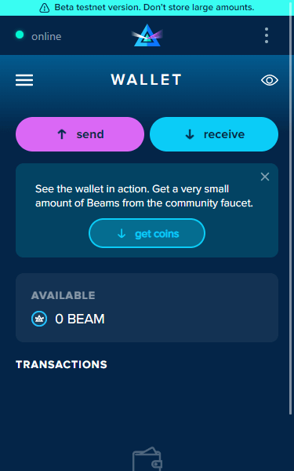

# Create a New Wallet


_**Never share your seed phrase with anyone. Those who know your seed phrase will have access to your funds!**_


## Full Browser View:

### Create a New Wallet

Launch your web wallet and "Create new wallet."

### Generate seed phrase

### Write down seed phrase


_Double-check your spelling! Don't let a misspelling like 'funnel' and 'tunnel' prevent you from accessing your funds!_


.png>)

### Confirmation screen

Record your seed phrase (pen and paper recommended) and store it in a secure location. Do not screenshot your seed phrase or keep it on an electronic device where it is vulnerable to cyber attacks!

### Verify seed phrase

Enter six randomly select words from your seed phrase to complete the verification process.

### Create your wallet password

Select a password (ten characters minimum, at least one letter, number, or special symbol) that will give you access to your Beam wallet. Your wallet password is an extra lock for your device, while your seed phrase is a private key that identifies your wallet and can access your funds.

Choose a strong password, then select "start using your wallet."

### Wallet Dashboard

Congratulations! Your Beam web wallet is now ready! Send or Receive Beam, view your most recent transactions list directly from the Beam web wallet dashboard.

## Extension view

### Create new wallet

Launch your web wallet and "Create new wallet."

### Generate seed phrase

### Write down your seed phrase


_Double-check your spelling! Don't let a misspelling like 'funnel' and 'tunnel' prevent you from accessing your funds!_


.png>)

### Confirmation screen

Record your seed phrase (pen and paper recommended) and store it in a secure location. Do not screenshot your seed phrase or keep it on an electronic device where it is vulnerable to cyber attacks!

### Verify seed phrase

Enter six randomly select words from your seed phrase to complete the verification process.

### Create your wallet password

Select a password (ten characters minimum, at least one letter, number, or special symbol) that will give you access to your Beam wallet. Your wallet password is an extra lock for your device, while your seed phrase is a private key that identifies your wallet and can access your funds.

Choose a strong password, then select "start using your wallet."

### Wallet dashboard

Congratulations! Your Beam web wallet is now ready! Send or Receive Beam, view your most recent transactions list directly from the Beam web wallet dashboard!

