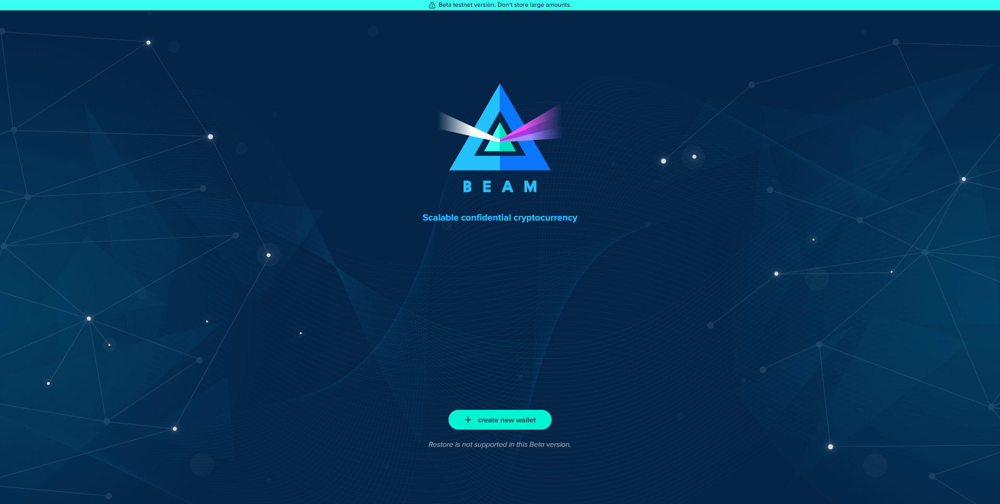

# Easy Onboarding


&#x20;_Your seed phrase is the only way you (or anybody) can access your funds. Your seed phrase is not linked to your email or phone number. If you forget your wallet password or lose your device, the only way to restore your wallet is through your seed phrase!_


## Create New Wallet

The easiest way. After installation and clicking on the button “Create new wallet”, a user can skip the step about verifying seed by clicking on “I will do it later”. Take a look at the following screenshots.

Web Browser View:

## Generate Seed Phrase

Select "I understand" to continue to the next step of the verification process.

## Skip Verification

Beam web wallet users can skip the seed verification process (click "I will do it later") and start using their  web wallets right away. **Please note**: not recording and verifying your seed phrase could result in the loss of your Beam coins!

## Setting Wallet Password

Select a password (eight characters minimum, at least one letter, number, or special symbol) that will give you access to your Beam wallet. Your wallet password is an extra lock for your device, while your seed phrase is a private key that identifies your wallet and can access your funds.

Choose a strong password

## Synchronizing your Wallet

Now that your web wallet is created, it's to synchronize with blockchain in its most current state on the Beam network.&#x20;

This may take a few minutes depending on your internet connection.

## Wallet Dashboard

Once your web wallet synchs with the blockchain, you are ready to started using your Web Wallet.

Send or Receive Beam coins, see your most recent transactions directly from your Beam wallet dashboard!

