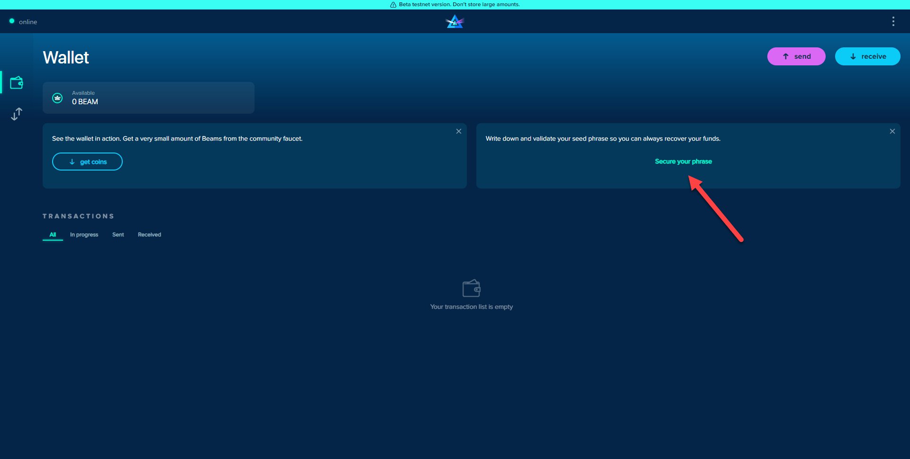
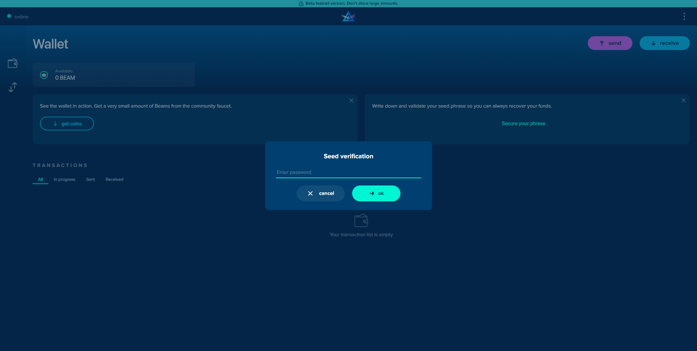
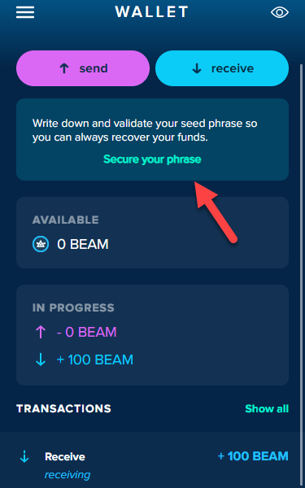
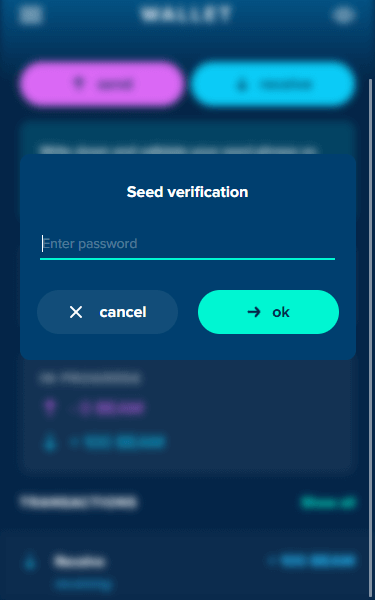
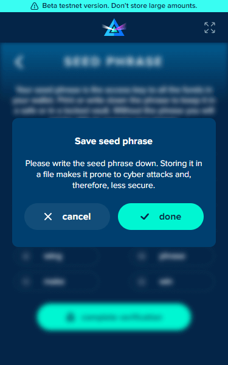

# Seed Verification

If you skip the seed verification process, your web wallet will give you pop-up reminders to verify your wallet. You can close these pop-ups, but once your wallet balance exceeds 100 Beams, the notification will stay open until you secure your seed phrase.

## Full View

### Pop-up Window 'Secure your Seed'

Select “secure your phrase” to start the seed verification process.

### Enter Password

You will receive a prompt to asking you to confirm your wallet password before moving to the next step of the seed verification process.

### Record your Seed Phrase

Record your seed phrase (pen and paper recommended), make multiple copies and store them somewhere safe. Your seed phrase is for your eyes only. Never share your seed phrase with anyone!

### Verify Seed Phrase

Verify your seed phrase.&#x20;

### Complete Verification

Enter six randomly selected words of your seed phrase to complete the verification (and never see this pop-up window again).

## Extension view:

### From the pop-window up:

Select “Secure your phrase” to begin

### Enter Password:

Enter your web wallet password to continue verifying your seed phrase.

### Verify Seed Phrase

Record your seed phrase (pen and paper recommended), make multiple copies and keep it safe. Your seed phrase is not connected to your email address or phone number. Losing your seed phrase could result in you losing access to your funds.

### Record your Seed Phrase

Double-check your spelling before storing your seed phrase in a secure location. Never share your seed phrase with anyone!

### Complete Verification

Enter six randomly selected words of your seed phrase to complete the verification process.

