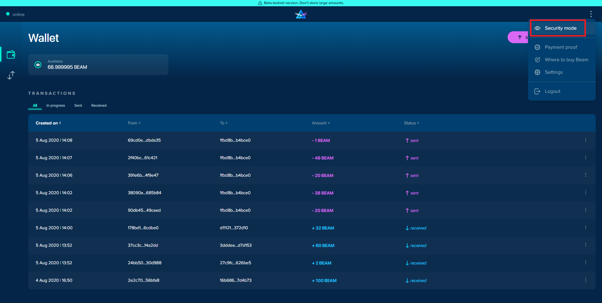
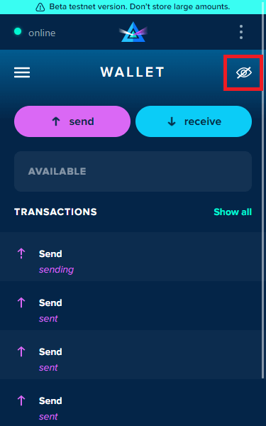

# Wallet Dashboard

Though Beam web wallet may be in the Testnet phase, it still offers users robust features and functionality. In this article, we will explore all the features the Beam web wallet offers.

The dashboard displays the available balance of Beam coins in your wallet. Send or Receive Beam, view your most recent transactions list directly from the Beam web wallet dashboard! The "wallet" icon and "swap" icons (located on the left side of the dashboard, beneath "wallet status") represent your wallet dashboard, UTXO screen, respectively. The action menu in the top right corner stores additional wallet functionalities (_Security Mode, Payment proof, Settings, and more)._

## Full Browser View:

### Wallet Dashboard

The dashboard displays the available balance of Beam remaining in your web wallet. View your most recent transactions, Send or Receive Beam directly from the wallet dashboard.

### Security Mode

"Security mode" enables your web wallet to hide sensitive information (balance, transaction lists) from wandering eyes.

## Extension view:

### Wallet Dashboard

The dashboard displays the available balance of Beam remaining in your web wallet. View your most recent transactions, Send or Receive Beam directly from the wallet dashboard.›

### Security mode

"Security mode" enables your web wallet to hide sensitive information (balance, transaction lists) from wandering eyes.

