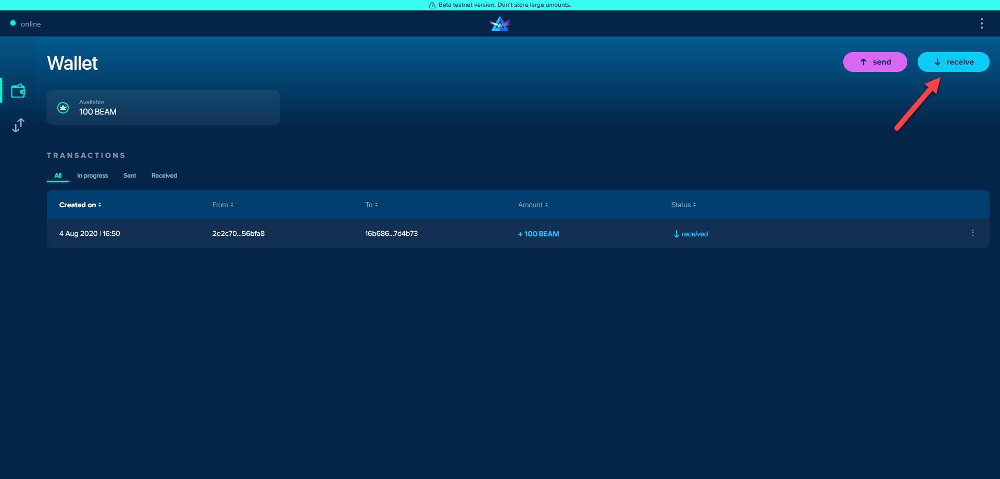
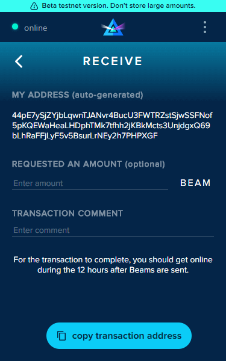

# Receiving Beam


_**As Beam web wallet is currently in Testnet, please consider:**_

* _SBBS addresses for Web Wallet are single-use only addresses._
* _Newly generated SBBS addresses expire after 12 hours._
* _Both Sender and Receiver wallets must be online to complete the transaction._
* _Always send addresses over **secure** communication channels._
* _It is possible to reuse an existing address (more information on that later)._


## Full Browser view:

### Generate an Address

From your wallet dashboard, select "receive" to be directed the receiving window.

### Copy Address

Copy and paste the newly generated Beam address (highlight right-click or "copy transaction address" from the drop-down menu) and forward it to the Sender over a **secure** communication channel.&#x20;

## Extension view:

### Generate an Address

From your wallet dashboard, select "receive" to be directed the receiving window.

.png>)

### Copy address

Copy and paste the newly generated Beam address (highlight right-click or "copy transaction address" from the drop-down menu) and forward it to the Sender over a **secure** communication channel.&#x20;

